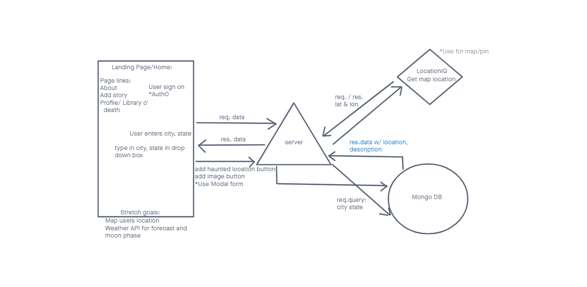
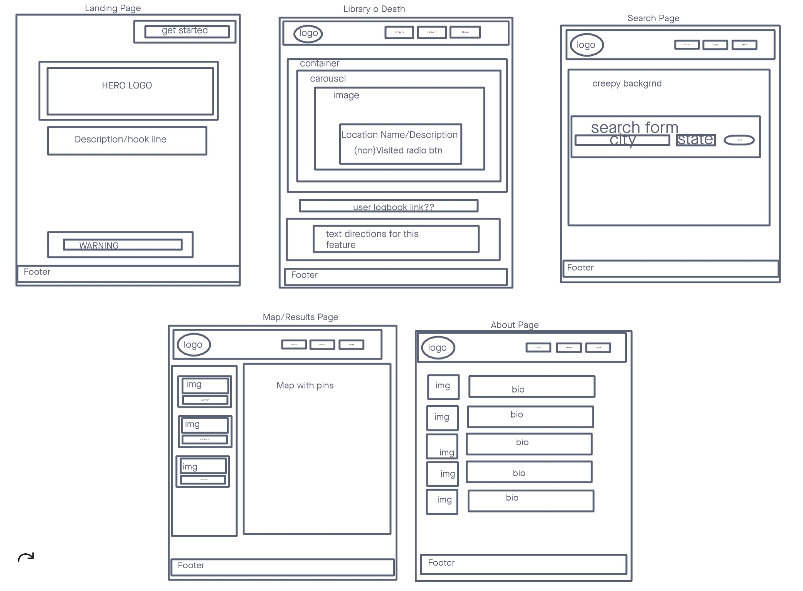

<a href = 'https://trello.com/b/RzdRKIEg/inspectre-project-board'>User Stories</a>

## Location Schema

## Design Wireframe

## Credits

- Glitch Animation CSS Walkthrough and Code: https://codepen.io/mattgrosswork/pen/VwprebG
- Prefers Reduced Motion: https://web.dev/prefers-reduced-motion/#(bonus)-forcing-reduced-motion-on-all-websites
- Haunted Location Data: https://data.world/timothyrenner/haunted-places
